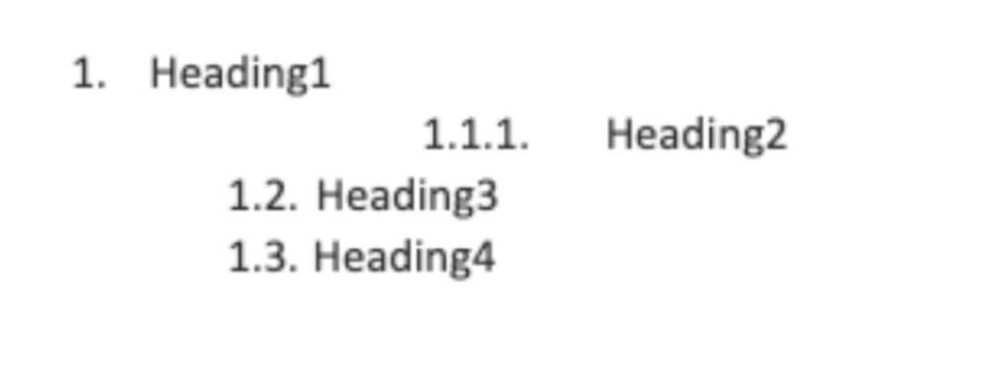

# Zadanie 05 - nagłówki 

Na podstawie zestawu rekordów:

```
{ id: 1, title: "heading1", heading_level: 0 },
{ id: 2, title: "heading2", heading_level: 2 },
{ id: 3, title: "heading3", heading_level: 1 },
{ id: 4, title: "heading4", heading_level: 1 }
``` 

napisz algorytm który symulowałby zachowanie nagłówków w
markdown 

Przetestuj dla innych zestawów:

```
# zestaw 1
{ id: 1, title: "heading1", heading_level: 0 },
{ id: 2, title: "heading2", heading_level: 3 },
{ id: 3, title: "heading3", heading_level: 4 },
{ id: 4, title: "heading4", heading_level: 1 },
{ id: 5, title: "heading5", heading_level: 0 }

# zestaw 2
{ id: 1, title: "heading1", heading_level: 3 },
{ id: 2, title: "heading2", heading_level: 2 },
{ id: 3, title: "heading3", heading_level: 1 },
{ id: 4, title: "heading4", heading_level: 5 },
{ id: 5, title: "heading5", heading_level: 0 }

```

Rozszerzenie:

Zasymuluj zachowanie nagłówków w Word / Libre office 
wraz z poprawną numeracją.

Na podstawie zestawu rekordów:
```
{ id: 1, title: "Heading1", heading_level: 0 },
{ id: 2, title: "Heading2", heading_level: 2 },
{ id: 3, title: "Heading3", heading_level: 1 },
{ id: 4, title: "Heading4", heading_level: 1 }
```

